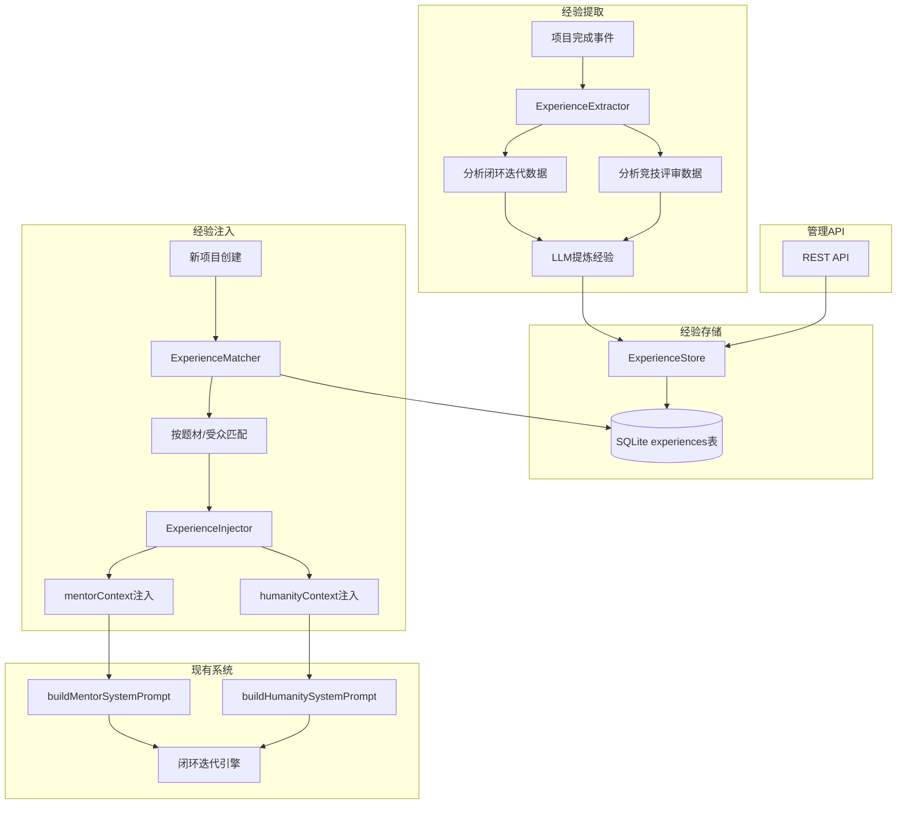

# 设计文档：Agent经验累积系统

## 概述

Agent经验累积系统为Seedance 2.0的多Agent剧本创作系统增加跨项目的经验记忆能力。系统采用"提取-存储-匹配-注入"四阶段架构，与现有的闭环迭代引擎和竞技引擎无缝集成。

核心设计决策：
- **复用已有扩展接口**：通过`buildMentorSystemPrompt`和`buildHumanitySystemPrompt`的`extraContext`参数注入经验，无需修改现有Agent调用链路
- **LLM驱动的经验提取**：利用已有的`chatCompletionJSON`封装，让LLM从迭代记录中提炼结构化经验
- **SQLite持久化**：复用现有的sql.js + db-service模式，新增experiences表
- **Token预算控制**：注入经验时严格控制token消耗，避免prompt膨胀

## 架构



## 组件与接口

### 1. ExperienceExtractor（经验提取器）

位置：`server/src/experience-extractor.ts`

职责：从已完成项目的历史数据中提取结构化经验。

```typescript
// 经验提取入口 - 闭环模式
async function extractFromLoopProject(projectId: string): Promise<Experience[]>

// 经验提取入口 - 竞技模式
async function extractFromArenaProject(projectId: string): Promise<Experience[]>

// 统一提取入口（自动判断模式）
async function extractExperiences(projectId: string): Promise<Experience[]>
```

提取流程：
1. 从`screenplay_projects`表读取项目数据，获取config和迭代记录
2. 将迭代记录（导师反馈、人性反馈、中枢裁决）序列化为文本
3. 调用`chatCompletionJSON`让LLM分析并提炼结构化经验
4. 为每条经验计算质量分数（基于项目最终评分）
5. 调用ExperienceStore存储经验

### 2. ExperienceStore（经验存储层）

位置：`server/src/experience-store.ts`

职责：经验的CRUD操作和数据库交互，复用db-service的模式。

```typescript
// 初始化experiences表（在initDB中调用）
function initExperienceTable(): void

// CRUD操作
function insertExperience(exp: ExperienceRow): void
function getExperienceById(id: string): ExperienceRow | null
function listExperiences(filter?: ExperienceFilter): ExperienceRow[]
function updateExperience(id: string, fields: Partial<ExperienceRow>): void
function deleteExperience(id: string): void
function incrementReferenceCount(id: string): void

// 去重：按来源项目查询
function listExperiencesBySourceProject(projectId: string): ExperienceRow[]

// 统计
function getExperienceStats(): ExperienceStats
```

### 3. ExperienceMatcher（经验匹配器）

位置：`server/src/experience-matcher.ts`

职责：根据项目配置从经验库中检索和排序相关经验。

```typescript
// 匹配经验
function matchExperiences(config: ScreenplayConfig, options?: MatchOptions): ExperienceRow[]
```

匹配算法：
1. 从experiences表中查询质量分数 >= 最低阈值的经验
2. 计算每条经验与当前项目的相关性分数：
   - 题材完全匹配（genres交集 = 经验genres）：+100分
   - 题材部分匹配（genres有交集）：+60分
   - 受众匹配：+30分
   - 通用经验（无特定题材/受众限制）：+10分
3. 同相关性分数内按质量分数降序排列
4. 引用次数超过上限的经验降低优先级（相关性分数 × 0.5）

### 4. ExperienceInjector（经验注入器）

位置：`server/src/experience-injector.ts`

职责：将匹配到的经验格式化并注入到Agent的context中。

```typescript
// 构建注入文本
function buildInjectionContext(
  experiences: ExperienceRow[],
  targetAgent: 'mentor' | 'humanity',
  tokenBudget: number
): string

// 为闭环模式注入经验（返回增强后的LoopConfig）
function injectForLoopMode(config: ScreenplayConfig, loopConfig: Partial<LoopConfig>): Partial<LoopConfig>

// 为竞技模式注入经验（返回增强后的LoopConfig片段）
function injectForArenaMode(config: ScreenplayConfig): { mentorContext?: string; humanityContext?: string }
```

注入策略：
- `error_pattern` + `genre_rule` → 导师Agent的`mentorContext`
- `success_pattern` + `audience_rule` → 人性Agent的`humanityContext`
- 格式化为编号列表，每条经验包含类型标签和内容摘要
- 使用简单的字符数估算token（中文约1.5字符/token），严格控制在TokenBudget内

### 5. 经验管理路由

位置：`server/src/experience-routes.ts`

职责：提供REST API端点，复用Express路由模式。

```typescript
// Express Router
const router = express.Router();

// GET /api/experiences - 列表（支持筛选）
// GET /api/experiences/stats - 统计信息
// GET /api/experiences/:id - 详情
// PUT /api/experiences/:id - 更新
// DELETE /api/experiences/:id - 删除
// POST /api/experiences/extract/:projectId - 手动触发提取
```

## 数据模型

### Experience 数据结构

```typescript
interface ExperienceRow {
  id: string;                    // UUID
  type: ExperienceType;          // 经验类型
  genres: string;                // JSON数组字符串，适用题材列表 如 '["都市","悬疑"]'
  audience: string;              // 适用受众：'男频' | '女频' | '全年龄' | ''（空=通用）
  summary: string;               // 经验内容摘要
  source_project_id: string;     // 来源项目ID
  source_mode: 'loop' | 'arena'; // 来源模式
  quality_score: number;         // 质量分数 0-100
  reference_count: number;       // 引用次数
  created_at: number;            // 创建时间戳
  updated_at: number;            // 更新时间戳
}

type ExperienceType = 'error_pattern' | 'success_pattern' | 'genre_rule' | 'audience_rule';

interface ExperienceFilter {
  type?: ExperienceType;
  genre?: string;
  audience?: string;
  minScore?: number;
}

interface ExperienceStats {
  total: number;
  byType: Record<ExperienceType, number>;
  byGenre: Record<string, number>;
  avgQualityScore: number;
}

interface MatchOptions {
  minScore?: number;          // 最低质量分数，默认40
  maxReferenceCount?: number; // 引用次数上限，默认50
  limit?: number;             // 最大返回条数，默认20
}
```

### SQLite表结构

```sql
CREATE TABLE IF NOT EXISTS experiences (
  id TEXT PRIMARY KEY,
  type TEXT NOT NULL,
  genres TEXT DEFAULT '[]',
  audience TEXT DEFAULT '',
  summary TEXT NOT NULL,
  source_project_id TEXT NOT NULL,
  source_mode TEXT NOT NULL,
  quality_score REAL DEFAULT 0,
  reference_count INTEGER DEFAULT 0,
  created_at INTEGER,
  updated_at INTEGER
);
```

### LLM提取Prompt的输出结构

```typescript
interface ExtractedExperience {
  type: ExperienceType;
  genres: string[];
  audience: string;
  summary: string;
  qualityIndicator: 'high' | 'medium' | 'low'; // LLM自评，辅助质量分数计算
}
```


## 正确性属性

*正确性属性是系统在所有有效执行中都应保持为真的特征或行为——本质上是关于系统应该做什么的形式化陈述。属性是人类可读规范与机器可验证正确性保证之间的桥梁。*

### Property 1: 经验提取结果结构完整性

*For any* 有效的项目数据（无论是闭环模式还是竞技模式），经验提取函数返回的每条经验都应包含所有必要字段（type、genres、audience、summary、source_project_id、quality_score），且type为四种有效类型之一，quality_score在0-100范围内，genres为有效的字符串数组。

**Validates: Requirements 1.1, 1.2, 1.4, 4.1**

### Property 2: 经验存储round-trip一致性

*For any* 有效的ExperienceRow数据，插入到ExperienceStore后再通过ID读取，返回的数据应与原始数据在所有字段上等价（id、type、genres、audience、summary、source_project_id、source_mode、quality_score）。

**Validates: Requirements 2.1, 2.2**

### Property 3: 经验筛选结果满足筛选条件

*For any* 经验数据集和任意筛选条件（type、genre、audience、minScore的组合），listExperiences返回的每条经验都应满足所有指定的筛选条件。

**Validates: Requirements 2.3**

### Property 4: 经验更新正确性

*For any* 已存储的经验和任意有效的更新字段值，调用updateExperience后再读取，被更新的字段应反映新值，未更新的字段应保持原值。

**Validates: Requirements 2.4, 4.4**

### Property 5: 经验去重幂等性

*For any* 来源项目ID，对同一个source_project_id连续执行两次经验存储（upsert），数据库中该source_project_id对应的经验条数应等于单次存储的条数，且内容为最后一次存储的值。

**Validates: Requirements 2.6**

### Property 6: 经验匹配排序正确性

*For any* 经验数据集和任意ScreenplayConfig，ExperienceMatcher返回的结果列表中，对于任意相邻的两条经验(i, i+1)，经验i的相关性分数应 >= 经验i+1的相关性分数；同相关性分数内，经验i的质量分数应 >= 经验i+1的质量分数。

**Validates: Requirements 3.1, 3.2**

### Property 7: 经验注入类型路由正确性

*For any* 经验列表，调用buildInjectionContext(experiences, 'mentor', budget)返回的文本应只包含error_pattern和genre_rule类型经验的内容；调用buildInjectionContext(experiences, 'humanity', budget)返回的文本应只包含success_pattern和audience_rule类型经验的内容。

**Validates: Requirements 3.3, 3.4, 3.6**

### Property 8: Token预算不变量

*For any* 经验列表和任意正整数TokenBudget，ExperienceInjector生成的注入文本的估算token数不应超过TokenBudget。

**Validates: Requirements 3.5**

### Property 9: 引用计数递增正确性

*For any* 经验条目，每次成功注入后该经验的reference_count应恰好增加1。

**Validates: Requirements 3.7**

### Property 10: 低质量经验过滤

*For any* 经验数据集和任意质量阈值minScore，ExperienceMatcher返回的结果中不应包含quality_score低于minScore的经验。

**Validates: Requirements 4.2**

### Property 11: 高引用经验优先级降级

*For any* 两条相关性分数相同、质量分数相同但引用次数不同的经验，引用次数超过上限的经验在匹配结果中的排序应低于未超过上限的经验。

**Validates: Requirements 4.3**

## 错误处理

### 经验提取阶段

| 错误场景 | 处理策略 |
|---------|---------|
| LLM调用失败 | 记录错误日志，跳过当前提取步骤，返回已成功提取的经验（Requirements 1.5） |
| 项目数据不存在 | 返回空数组，不抛出异常 |
| LLM返回格式异常 | 使用已有的`extractJSON`和`tryRepairTruncatedJSON`尝试修复，失败则跳过该条经验 |
| 项目无迭代数据 | 返回空数组，记录警告日志 |

### 经验存储阶段

| 错误场景 | 处理策略 |
|---------|---------|
| 数据库写入失败 | 抛出异常，由调用方处理 |
| ID冲突 | 使用UUID v4生成，冲突概率极低；去重逻辑基于source_project_id而非id |

### 经验匹配与注入阶段

| 错误场景 | 处理策略 |
|---------|---------|
| 经验库为空 | 返回空字符串，不注入任何经验，不影响正常创作流程 |
| Token预算为0或负数 | 使用默认预算2000 |

### API层

| 错误场景 | 处理策略 |
|---------|---------|
| 经验ID不存在 | 返回404状态码和描述性错误信息（Requirements 5.7） |
| 请求参数无效 | 返回400状态码和参数校验错误信息 |
| 提取目标项目不存在 | 返回404状态码 |

## 测试策略

### 属性测试（Property-Based Testing）

使用项目已安装的 `fast-check` 库进行属性测试。每个属性测试至少运行100次迭代。

测试标签格式：**Feature: agent-memory-system, Property {number}: {property_text}**

属性测试覆盖的核心模块：
- **ExperienceStore CRUD**：round-trip一致性（Property 2）、筛选正确性（Property 3）、更新正确性（Property 4）、去重幂等性（Property 5）
- **ExperienceMatcher**：排序正确性（Property 6）、低质量过滤（Property 10）、高引用降级（Property 11）
- **ExperienceInjector**：类型路由正确性（Property 7）、Token预算不变量（Property 8）、引用计数递增（Property 9）

### 单元测试

单元测试聚焦于具体示例和边界条件：
- 经验提取：手动触发未完成项目的提取（Requirements 1.3）、LLM调用失败时的降级处理（Requirements 1.5）
- API端点：各端点的基本功能验证（Requirements 5.1-5.6）、404错误处理（Requirements 5.7）
- 经验提取结果的结构验证（Property 1的具体示例）

### 测试配置

```typescript
// vitest.config.ts 中已有配置，属性测试文件放在 server/src/__tests__/ 目录下
// 属性测试文件命名：experience-*.property.test.ts
// 单元测试文件命名：experience-*.test.ts
```

### 双重测试策略

- **属性测试**：验证跨所有输入的通用属性，通过随机化发现边界情况
- **单元测试**：验证具体示例、集成点和错误条件
- 两者互补：属性测试覆盖广度，单元测试覆盖深度
