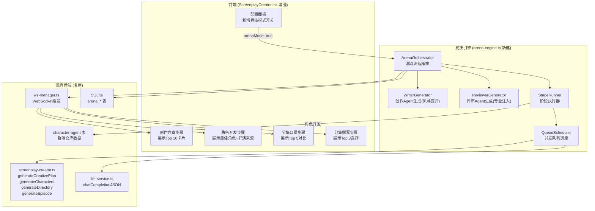
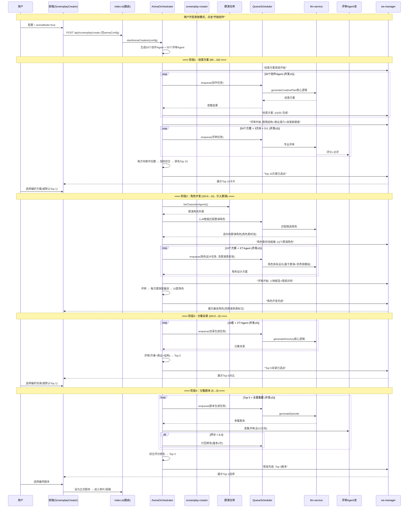

# 技术设计文档：百Agent竞技创作模式（漏斗式阶段竞争）

## 概述

百Agent竞技创作模式深度嵌入现有剧本创作流水线（`screenplay-creator.ts`），在每个创作阶段引入多Agent竞争+专业评审筛选，形成逐级收窄的漏斗。不是独立模块，而是现有创作流程的"增强模式"。

### 漏斗模型

```
阶段1：创意方案    50个创作Agent → 评审筛选 → Top 10 方案
阶段2：角色开发    10×3个Agent + 群演仓库 → 评审筛选 → 10套角色
阶段3：分集目录    10×2个Agent → 评审筛选 → Top 5 目录
阶段4：分集剧本    Top 5 全量生成 → 逐集评审打回 → Top 3 剧本
阶段5：用户选择    Top 3 → 用户选1 → 进入审片/投稿
```

### 核心设计决策

1. **嵌入而非独立**：竞技模式作为 `ScreenplayConfig.arenaMode` 开关嵌入现有流程，复用 `screenplay-creator.ts` 的所有生成函数
2. **阶段式评审**：每个阶段只激活相关的评审方向（而非全部50人），节省LLM调用成本
3. **群演仓库深度集成**：角色开发阶段优先从群演仓库匹配角色，复用现有 `generateCharactersFromPool` 的世界观模拟机制
4. **用户可介入**：每个阶段的筛选结果都展示给用户，用户可以手动选择偏好，而非完全自动化
5. **并发队列调度**：所有Agent的LLM调用通过 `QueueScheduler` 控制并发上限

## 架构

### 系统架构图



### 完整漏斗流程



## 组件与接口

### 后端模块

#### 1. arena-engine.ts — 竞技引擎（新建）

竞技模式的核心编排逻辑，独立于 `screenplay-creator.ts`，但深度调用其内部函数。

```typescript
import { ScreenplayConfig, ScreenplayProject } from './screenplay-creator.js';

// ============ 配置类型 ============

interface ArenaConfig {
  writerCount: number;        // 创作Agent数量，默认50
  groupCount: number;         // 分组数，默认5
  strictness: 'standard' | 'strict' | 'extreme'; // 评审严格度
  concurrency: number;        // LLM并发数，默认5
  passScore: number;          // 通过分数线，standard=5.5, strict=6.0, extreme=7.0
}

// ============ 主入口 ============

// 启动竞技创作（替代普通的逐步生成）
export async function startArenaCreation(
  projectId: string,
  arenaConfig: ArenaConfig,
  taskId: string
): Promise<void>;

// 停止竞技创作
export function stopArenaCreation(projectId: string): void;

// 用户选择某阶段的候选
export function selectCandidate(
  projectId: string,
  stage: FunnelStage,
  candidateId: string
): void;

// ============ 阶段执行器 ============

// 阶段1：创意方案竞争
async function runCreativePlanArena(
  projectId: string,
  writers: WriterAgent[],
  reviewers: ReviewerAgent[],
  taskId: string
): Promise<StageCandidates<CreativePlan>>;

// 阶段2：角色开发竞争（含群演仓库）
async function runCharacterArena(
  projectId: string,
  topPlans: StageCandidates<CreativePlan>,
  writers: WriterAgent[],
  reviewers: ReviewerAgent[],
  taskId: string
): Promise<StageCandidates<CharacterDesign>>;

// 阶段3：分集目录竞争
async function runDirectoryArena(
  projectId: string,
  topCombos: StageCandidates<PlanCharCombo>,
  writers: WriterAgent[],
  reviewers: ReviewerAgent[],
  taskId: string
): Promise<StageCandidates<EpisodeDirectory>>;

// 阶段4：分集剧本全量+逐集评审
async function runEpisodeArena(
  projectId: string,
  topDirs: StageCandidates<FullCombo>,
  writers: WriterAgent[],
  reviewers: ReviewerAgent[],
  taskId: string
): Promise<StageCandidates<FullScreenplay>>;
```

#### 2. 创作Agent风格变异生成

从10个系统Agent（`system-agents-data.ts`）的风格基因中变异派生50个创作Agent。

```typescript
interface StyleGene {
  baseStyleId: string;          // 派生自哪个系统Agent
  narrativeStructure: string;   // 叙事结构偏好（从systemPrompt中提取）
  characterMethod: string;      // 角色塑造方法
  dialogueStyle: string;        // 对白风格
  emotionRhythm: string;        // 情绪节奏
  hookDesign: string;           // 钩子设计
}

interface WriterAgent {
  id: string;
  name: string;
  styleGene: StyleGene;
  systemPrompt: string;         // 编译后的完整创作Prompt
}

// 变异策略：10个系统Agent各派生5个变体 = 50个
// 每个变体在父代基础上随机变异1-2个基因维度
// 变异方式：
//   - 替换：用另一个系统Agent的对应基因替换
//   - 增强：强化某个特征（如"钩子密度×2"）
//   - 融合：取两个系统Agent的对应基因做混合

function generateWriterAgents(count: number): WriterAgent[] {
  const agents: WriterAgent[] = [];
  const perBase = Math.ceil(count / SYSTEM_AGENTS.length);
  
  for (const base of SYSTEM_AGENTS) {
    const baseGene = extractStyleGene(base);
    for (let i = 0; i < perBase && agents.length < count; i++) {
      const mutated = mutateStyleGene(baseGene, SYSTEM_AGENTS);
      agents.push({
        id: `writer-${agents.length}`,
        name: `${base.name}·变体${i + 1}`,
        styleGene: mutated,
        systemPrompt: compileWriterPrompt(mutated),
      });
    }
  }
  return agents;
}

// 从系统Agent的systemPrompt中提取5个基因维度
function extractStyleGene(agent: SystemAgent): StyleGene {
  // 通过正则/关键词从systemPrompt的各个【】段落中提取
  const prompt = agent.systemPrompt;
  return {
    baseStyleId: agent.id,
    narrativeStructure: extractSection(prompt, '叙事结构偏好'),
    characterMethod: extractSection(prompt, '角色塑造方法'),
    dialogueStyle: extractSection(prompt, '对白风格'),
    emotionRhythm: extractSection(prompt, '情绪节奏'),
    hookDesign: extractSection(prompt, '钩子设计'),
  };
}

// 变异：随机选1-2个维度进行变异
function mutateStyleGene(base: StyleGene, allAgents: SystemAgent[]): StyleGene {
  const gene = { ...base };
  const dimensions: (keyof Omit<StyleGene, 'baseStyleId'>)[] = 
    ['narrativeStructure', 'characterMethod', 'dialogueStyle', 'emotionRhythm', 'hookDesign'];
  
  // 随机选1-2个维度
  const mutCount = 1 + Math.floor(Math.random() * 2);
  const selected = shuffle(dimensions).slice(0, mutCount);
  
  for (const dim of selected) {
    // 随机选另一个系统Agent的对应基因做替换/融合
    const donor = allAgents[Math.floor(Math.random() * allAgents.length)];
    const donorGene = extractStyleGene(donor);
    gene[dim] = Math.random() > 0.5 
      ? donorGene[dim]  // 替换
      : `${gene[dim]}\n同时融合：${donorGene[dim].slice(0, 200)}`; // 融合
  }
  return gene;
}
```

#### 3. 评审Agent专业体系

10个专业方向，每方向5人，按阶段按需激活。

```typescript
interface ReviewDirection {
  id: string;
  name: string;
  weight: number;               // 该方向在综合评分中的权重
  systemPrompt: string;         // 专业评审Prompt
  activeStages: FunnelStage[];  // 在哪些阶段激活
}

type FunnelStage = 'creative_plan' | 'character' | 'directory' | 'episode';

interface ReviewerAgent {
  id: string;
  directionId: string;
  directionName: string;
  systemPrompt: string;
  weight: number;
}

// 各阶段激活的评审方向
const STAGE_REVIEW_MAP: Record<FunnelStage, string[]> = {
  creative_plan: ['plot_structure', 'commercial_potential', 'creativity'],
  character: ['characterization', 'emotional_resonance'],
  directory: ['pacing', 'commercial_potential', 'plot_structure'],
  episode: [/* 全部10个方向 */],
};

const REVIEW_DIRECTIONS: ReviewDirection[] = [
  {
    id: 'plot_structure',
    name: '剧情结构专家',
    weight: 0.15,
    activeStages: ['creative_plan', 'directory', 'episode'],
    systemPrompt: `你是一位资深的剧情结构分析师...（同前文设计）`,
  },
  {
    id: 'characterization',
    name: '人物塑造专家',
    weight: 0.12,
    activeStages: ['character', 'episode'],
    systemPrompt: `你是一位专精角色心理学的编剧顾问...`,
  },
  {
    id: 'dialogue_quality',
    name: '对白质量专家',
    weight: 0.10,
    activeStages: ['episode'],
    systemPrompt: `你是一位台词功力深厚的对白专家...`,
  },
  {
    id: 'pacing',
    name: '节奏把控专家',
    weight: 0.12,
    activeStages: ['directory', 'episode'],
    systemPrompt: `你是一位精通短剧节奏设计的节奏大师...`,
  },
  {
    id: 'commercial_potential',
    name: '商业潜力专家',
    weight: 0.15,
    activeStages: ['creative_plan', 'directory', 'episode'],
    systemPrompt: `你是一位短剧平台的资深商业分析师...`,
  },
  {
    id: 'creativity',
    name: '创意新颖度专家',
    weight: 0.10,
    activeStages: ['creative_plan', 'episode'],
    systemPrompt: `你是一位追求创新的先锋编剧评论家...`,
  },
  {
    id: 'emotional_resonance',
    name: '情感共鸣专家',
    weight: 0.10,
    activeStages: ['character', 'episode'],
    systemPrompt: `你是一位深谙观众心理的情感分析师...`,
  },
  {
    id: 'visual_narrative',
    name: '视觉叙事专家',
    weight: 0.08,
    activeStages: ['episode'],
    systemPrompt: `你是一位精通视觉语言的导演型编剧...`,
  },
  {
    id: 'compliance',
    name: '合规审核专家',
    weight: 0.03,
    activeStages: ['episode'],
    systemPrompt: `你是一位短剧平台的内容合规审核员...`,
  },
  {
    id: 'production_feasibility',
    name: '综合制片专家',
    weight: 0.05,
    activeStages: ['episode'],
    systemPrompt: `你是一位经验丰富的短剧制片人...`,
  },
];
```

#### 4. 并发队列调度器

```typescript
// server/src/queue-scheduler.ts
// 基于 Promise 的并发控制队列，支持重试和超时

interface QueueTask<T> {
  fn: () => Promise<T>;
  retries?: number;       // 剩余重试次数，默认3
  timeout?: number;       // 超时ms，默认120000
}

class QueueScheduler {
  private concurrency: number;
  private running = 0;
  private queue: Array<{
    task: QueueTask<any>;
    resolve: (v: any) => void;
    reject: (e: any) => void;
  }> = [];
  private stopped = false;

  constructor(concurrency = 5) {
    this.concurrency = concurrency;
  }

  async enqueue<T>(fn: () => Promise<T>, retries = 3, timeout = 120000): Promise<T> {
    if (this.stopped) throw new Error('Scheduler stopped');
    return new Promise((resolve, reject) => {
      this.queue.push({ task: { fn, retries, timeout }, resolve, reject });
      this.drain();
    });
  }

  async enqueueBatch<T>(tasks: Array<() => Promise<T>>): Promise<T[]> {
    return Promise.all(tasks.map(fn => this.enqueue(fn)));
  }

  stop(): void {
    this.stopped = true;
    // 拒绝队列中所有等待的任务
    for (const { reject } of this.queue) {
      reject(new Error('Scheduler stopped'));
    }
    this.queue = [];
  }

  private async drain(): Promise<void> {
    while (this.running < this.concurrency && this.queue.length > 0 && !this.stopped) {
      const item = this.queue.shift()!;
      this.running++;
      this.executeWithRetry(item.task, item.resolve, item.reject)
        .finally(() => { this.running--; this.drain(); });
    }
  }

  private async executeWithRetry<T>(
    task: QueueTask<T>,
    resolve: (v: T) => void,
    reject: (e: any) => void
  ): Promise<void> {
    try {
      const result = await Promise.race([
        task.fn(),
        new Promise<never>((_, rej) => 
          setTimeout(() => rej(new Error('Timeout')), task.timeout)
        ),
      ]);
      resolve(result);
    } catch (err) {
      if ((task.retries ?? 0) > 0) {
        // 指数退避重试
        const delay = (4 - (task.retries ?? 0)) * 2000;
        await new Promise(r => setTimeout(r, delay));
        task.retries = (task.retries ?? 0) - 1;
        return this.executeWithRetry(task, resolve, reject);
      }
      reject(err);
    }
  }
}

export { QueueScheduler };
```

#### 5. 角色开发阶段的群演仓库集成

角色开发阶段的核心逻辑：先从群演仓库匹配角色素材，再让多Agent基于素材竞争设计角色体系。

```typescript
async function runCharacterArena(
  projectId: string,
  topPlans: StageCandidates<CreativePlan>,
  writers: WriterAgent[],
  reviewers: ReviewerAgent[],
  taskId: string
): Promise<StageCandidates<CharacterDesign>> {
  
  // 第1步：从群演仓库匹配角色素材（复用现有逻辑）
  const allCharAgents = listCharacterAgents();
  let characterPool: CharacterAgentRow[] = [];
  
  if (allCharAgents.length > 0) {
    // 复用 generateCharactersFromPool 中的LLM智能匹配逻辑
    // 为每个Top方案匹配候选角色
    characterPool = await matchCharacterPool(
      projectId, allCharAgents, topPlans.candidates[0].data
    );
    broadcastProgress(taskId, `角色素材池就绪: ${characterPool.length}个群演角色`);
  }
  
  // 第2步：为每个方案分配3个创作Agent竞争
  const candidates: CandidateEntry<CharacterDesign>[] = [];
  const agentsPerPlan = 3;
  
  for (let planIdx = 0; planIdx < topPlans.candidates.length; planIdx++) {
    const plan = topPlans.candidates[planIdx];
    const assignedWriters = writers.slice(
      planIdx * agentsPerPlan, 
      (planIdx + 1) * agentsPerPlan
    );
    
    // 3个Agent并发设计角色体系
    const designs = await scheduler.enqueueBatch(
      assignedWriters.map(writer => () => 
        generateCharacterDesign(projectId, plan.data, characterPool, writer)
      )
    );
    
    for (const design of designs) {
      if (design) candidates.push({ 
        id: `char-${candidates.length}`,
        planId: plan.id,
        data: design,
        score: 0,
      });
    }
  }
  
  // 第3步：评审（人物塑造+情感共鸣）
  const activeReviewers = reviewers.filter(r => 
    ['characterization', 'emotional_resonance'].includes(r.directionId)
  );
  
  for (const candidate of candidates) {
    candidate.score = await reviewCandidate(
      projectId, candidate, activeReviewers, 'character'
    );
  }
  
  // 第4步：每个方案保留最佳角色设计
  const bestPerPlan = selectBestPerGroup(candidates, 'planId', 1);
  return { stage: 'character', candidates: bestPerPlan };
}

// 角色设计生成（单个Agent）
// 如果有群演素材池，基于群演角色+世界观模拟设计
// 如果没有，纯LLM生成
async function generateCharacterDesign(
  projectId: string,
  plan: CreativePlan,
  characterPool: CharacterAgentRow[],
  writer: WriterAgent
): Promise<CharacterDesign | null> {
  
  const systemPrompt = characterPool.length > 0
    ? buildCharacterDesignPromptWithPool(plan, characterPool, writer)
    : buildCharacterDesignPromptDefault(plan, writer);
  
  // 调用LLM生成角色体系
  const result = await llmJSON<CharacterDesign>(
    projectId, 
    `arena_char_${writer.id}`,
    systemPrompt,
    buildCharacterDesignUserPrompt(plan, characterPool)
  );
  
  return result.success ? result.data ?? null : null;
}

// 构建含群演素材的角色设计Prompt
function buildCharacterDesignPromptWithPool(
  plan: CreativePlan,
  pool: CharacterAgentRow[],
  writer: WriterAgent
): string {
  return `${writer.systemPrompt}

你现在需要为以下剧本设计角色体系。

【重要】以下是群演仓库中匹配到的候选角色素材，请优先从中选择和改编：
${pool.map(a => 
  `[${a.id}] ${a.name}（${a.role}）| 性格：${a.personality?.slice(0, 80)} | 描述：${a.description?.slice(0, 80)}`
).join('\n')}

选角原则：
1. 优先使用群演仓库中的角色，保留其核心性格和背景
2. 可以根据剧本需要调整角色的身份和动机
3. 如果群演角色不够用，可以新创角色补充
4. 必须标注每个角色是"群演改编"还是"原创新建"
5. 保留群演角色的原始ID（characterAgentId字段）

请输出严格JSON格式的角色体系设计。`;
}
```

#### 6. 评审通用函数

```typescript
// 通用评审函数：对一个候选产出进行多方向评审
async function reviewCandidate(
  projectId: string,
  candidate: CandidateEntry<any>,
  reviewers: ReviewerAgent[],
  stage: FunnelStage
): Promise<number> {
  
  // 按方向分组
  const byDirection = groupBy(reviewers, r => r.directionId);
  const directionScores: DirectionScore[] = [];
  
  for (const [dirId, dirReviewers] of Object.entries(byDirection)) {
    // 同方向5个Agent并发评审
    const scores = await scheduler.enqueueBatch(
      dirReviewers.map(reviewer => () =>
        executeSingleReview(projectId, candidate, reviewer, stage)
      )
    );
    
    const validScores = scores.filter(s => s !== null) as number[];
    if (validScores.length >= 3) {
      // 取中位数
      const median = calculateMedian(validScores);
      const direction = REVIEW_DIRECTIONS.find(d => d.id === dirId)!;
      directionScores.push({
        directionId: dirId,
        directionName: direction.name,
        rawScores: validScores,
        medianScore: median,
        weight: direction.weight,
      });
    }
  }
  
  // 加权综合评分（仅用激活方向的权重，归一化）
  const totalWeight = directionScores.reduce((s, d) => s + d.weight, 0);
  const weightedTotal = directionScores.reduce(
    (s, d) => s + d.medianScore * (d.weight / totalWeight), 0
  );
  
  return weightedTotal;
}

// 中位数计算
function calculateMedian(scores: number[]): number {
  const sorted = [...scores].sort((a, b) => a - b);
  const mid = Math.floor(sorted.length / 2);
  return sorted.length % 2 === 0
    ? (sorted[mid - 1] + sorted[mid]) / 2
    : sorted[mid];
}
```

#### 7. 路由集成（嵌入现有路由）

不新建独立路由文件，而是在现有 `index.ts` 的剧本创作路由中增加竞技模式分支。

```typescript
// 在 POST /api/screenplay/create 中
// 如果 config.arenaMode === true，创建项目后启动竞技流程
app.post('/api/screenplay/create', async (req, res) => {
  const config = req.body as ScreenplayConfig;
  const project = createScreenplay(config);
  
  if (config.arenaMode && config.arenaConfig) {
    // 竞技模式：启动异步竞技流程
    const taskId = createTaskId();
    startArenaCreation(project.id, config.arenaConfig, taskId);
    return res.json({ project, async: true, taskId });
  }
  
  // 普通模式：原有逻辑不变
  res.json({ project });
});

// 新增：用户选择某阶段候选
app.post('/api/screenplay/:id/arena/select', (req, res) => {
  const { stage, candidateId } = req.body;
  selectCandidate(req.params.id, stage, candidateId);
  res.json({ success: true });
});

// 新增：获取竞技状态和候选列表
app.get('/api/screenplay/:id/arena/status', (req, res) => {
  const status = getArenaStatus(req.params.id);
  res.json(status);
});

// 新增：获取某阶段的候选详情
app.get('/api/screenplay/:id/arena/candidates/:stage', (req, res) => {
  const candidates = getArenaCandidates(req.params.id, req.params.stage);
  res.json({ candidates });
});
```

### 前端组件改动

#### ScreenplayCreator.tsx 增强

不新建独立面板，而是在现有 `ScreenplayCreator.tsx` 中增加竞技模式的UI分支。

```
ScreenplayCreator.tsx (增强)
├── 配置步骤 (step === 'config')
│   └── 新增：ArenaToggle — 竞技模式开关+参数配置
├── 创作方案步骤 (step === 'plan')
│   └── 竞技模式时：ArenaPlanView — Top 10方案卡片列表(替代单一方案)
│       ├── PlanCard — 单个方案卡片(含评分雷达图缩略)
│       └── PlanCompare — 方案对比视图
├── 角色开发步骤 (step === 'characters')
│   └── 竞技模式时：ArenaCharView — 最佳角色展示+群演来源标注
│       ├── CharacterCard — 角色卡片(标注"群演改编"/"原创")
│       └── AlternativesDrawer — "查看其他候选"抽屉
├── 分集目录步骤 (step === 'directory')
│   └── 竞技模式时：ArenaDirView — Top 5目录对比
│       ├── DirCompareGrid — 目录对比网格
│       └── RhythmChart — 节奏曲线对比图
└── 分集撰写步骤 (step === 'writing')
    └── 竞技模式时：ArenaWriteView — Top 3剧本选择
        ├── ScreenplayRanking — 排名卡片
        └── ScoreRadar — 10维度雷达图对比
```

关键交互：
- 每个阶段的竞技进度通过现有的 `useTaskProgress` hook + WebSocket 实时展示
- 竞技完成后，候选列表替代原来的单一结果展示
- 用户点击"选择此方案"后，系统将其设为正式数据，UI切换到下一步骤
- 如果用户不选择，系统默认使用Top 1

## 数据模型

### 新增数据库表

#### arena_sessions — 竞技会话表

```sql
CREATE TABLE IF NOT EXISTS arena_sessions (
  id TEXT PRIMARY KEY,
  project_id TEXT NOT NULL,          -- 关联的ScreenplayProject ID
  config TEXT NOT NULL,              -- JSON: ArenaConfig
  status TEXT DEFAULT 'init',        -- 'init'|'stage_plan'|'stage_char'|'stage_dir'|'stage_ep'|'completed'|'stopped'
  current_stage TEXT,                -- 当前漏斗阶段
  task_id TEXT NOT NULL,
  created_at INTEGER,
  completed_at INTEGER
);
```

#### arena_writers — 创作Agent表

```sql
CREATE TABLE IF NOT EXISTS arena_writers (
  id TEXT PRIMARY KEY,
  session_id TEXT NOT NULL,
  name TEXT NOT NULL,
  base_style_id TEXT,                -- 派生自哪个系统Agent
  style_gene TEXT NOT NULL,          -- JSON: StyleGene
  system_prompt TEXT NOT NULL,
  created_at INTEGER
);
```

#### arena_reviewers — 评审Agent表

```sql
CREATE TABLE IF NOT EXISTS arena_reviewers (
  id TEXT PRIMARY KEY,
  session_id TEXT NOT NULL,
  direction_id TEXT NOT NULL,
  direction_name TEXT NOT NULL,
  system_prompt TEXT NOT NULL,
  weight REAL NOT NULL,
  created_at INTEGER
);
```

#### arena_candidates — 候选产出表

```sql
CREATE TABLE IF NOT EXISTS arena_candidates (
  id TEXT PRIMARY KEY,
  session_id TEXT NOT NULL,
  stage TEXT NOT NULL,               -- 'creative_plan'|'character'|'directory'|'episode'
  writer_id TEXT NOT NULL,
  parent_candidate_id TEXT,          -- 上一阶段的候选ID（追溯链）
  content TEXT NOT NULL,             -- JSON: 该阶段的产出内容
  character_pool_ids TEXT,           -- JSON: 使用的群演角色ID列表（角色阶段）
  created_at INTEGER
);
```

#### arena_reviews — 评审记录表

```sql
CREATE TABLE IF NOT EXISTS arena_reviews (
  id TEXT PRIMARY KEY,
  session_id TEXT NOT NULL,
  candidate_id TEXT NOT NULL,
  reviewer_id TEXT NOT NULL,
  direction_id TEXT NOT NULL,
  stage TEXT NOT NULL,
  score REAL NOT NULL,               -- 0-10
  comments TEXT NOT NULL,
  created_at INTEGER
);
```

#### arena_scores — 候选综合评分表

```sql
CREATE TABLE IF NOT EXISTS arena_scores (
  id TEXT PRIMARY KEY,
  session_id TEXT NOT NULL,
  candidate_id TEXT NOT NULL,
  stage TEXT NOT NULL,
  direction_scores TEXT NOT NULL,    -- JSON: DirectionScore[]
  weighted_total REAL NOT NULL,
  rank INTEGER,
  selected BOOLEAN DEFAULT FALSE,    -- 用户是否选择了此候选
  created_at INTEGER
);
```

### TypeScript 类型定义

```typescript
// ============ 配置 ============

interface ArenaConfig {
  writerCount: number;          // 默认50
  groupCount: number;           // 默认5
  strictness: 'standard' | 'strict' | 'extreme';
  concurrency: number;          // 默认5
  passScore: number;            // standard=5.5, strict=6.0, extreme=7.0
}

// 扩展现有 ScreenplayConfig
interface ScreenplayConfig {
  // ...现有字段...
  arenaMode?: boolean;
  arenaConfig?: ArenaConfig;
}

// ============ 漏斗阶段 ============

type FunnelStage = 'creative_plan' | 'character' | 'directory' | 'episode';

interface CandidateEntry<T> {
  id: string;
  writerId: string;
  parentCandidateId?: string;   // 上一阶段的候选ID
  data: T;                      // 该阶段的产出内容
  characterPoolIds?: string[];  // 使用的群演角色ID（角色阶段）
  score: number;                // 综合评分
  rank?: number;
  directionScores?: DirectionScore[];
  selected?: boolean;           // 用户是否选择
}

interface StageCandidates<T> {
  stage: FunnelStage;
  candidates: CandidateEntry<T>[];
  totalGenerated: number;       // 该阶段总共生成了多少个
  totalSurvived: number;        // 筛选后留下多少个
}

// 方案+角色组合（阶段3的输入）
interface PlanCharCombo {
  plan: CreativePlan;
  characters: CharacterDesign;
}

// 完整组合（阶段4的输入）
interface FullCombo {
  plan: CreativePlan;
  characters: CharacterDesign;
  directory: EpisodeDirectoryItem[];
}

// 完整剧本（阶段4的输出）
interface FullScreenplay {
  plan: CreativePlan;
  characters: CharacterDesign;
  directory: EpisodeDirectoryItem[];
  episodes: EpisodeScript[];
  reviews: Record<number, ReviewScore>;
}

// ============ 评审 ============

interface DirectionScore {
  directionId: string;
  directionName: string;
  rawScores: number[];          // 5个Agent的原始评分
  medianScore: number;
  weight: number;
  comments?: string[];
}

// ============ 竞技状态 ============

interface ArenaStatus {
  sessionId: string;
  projectId: string;
  config: ArenaConfig;
  status: string;
  currentStage: FunnelStage | null;
  stages: {
    creative_plan?: StageStatus;
    character?: StageStatus;
    directory?: StageStatus;
    episode?: StageStatus;
  };
  taskId: string;
}

interface StageStatus {
  status: 'pending' | 'creating' | 'reviewing' | 'selecting' | 'completed';
  totalCandidates: number;
  survivedCandidates: number;
  selectedCandidateId?: string;
  progress: string;
}
```

### ScreenplayConfig 扩展

在现有 `ScreenplayConfig` 接口中新增两个可选字段：

```typescript
// server/src/screenplay-creator.ts 中
interface ScreenplayConfig {
  genres: string[];
  audience: string;
  tone: string;
  endingType: string;
  totalEpisodes: number;
  language: string;
  mode: string;
  customPrompt?: string;
  agentId?: string;
  referenceNovel?: string;
  useCharacterPool?: boolean;
  useTimeline?: boolean;
  fixedModel?: LLMConfig;
  nsfw?: boolean;
  // 新增
  arenaMode?: boolean;          // 竞技模式开关
  arenaConfig?: ArenaConfig;    // 竞技参数
}
```

### WebSocket 推送格式

复用现有 `wsManager.broadcast(taskId, taskInfo)` 模式，progress 字段格式：

| 阶段 | progress 格式 |
|------|---------------|
| 初始化 | `"竞技初始化: 生成50个创作Agent + 50个评审Agent"` |
| 创意方案-创作 | `"创意方案: {n}/50 Agent完成"` |
| 创意方案-评审 | `"方案评审: {dim} {n}/5 完成 ({total_done}/{total_all})"` |
| 创意方案-筛选 | `"Top 10方案已选出, 最高分{score}"` |
| 角色-群演匹配 | `"群演匹配: 选中{n}个候选角色"` |
| 角色-创作 | `"角色设计: 方案{p} Agent{a}/3 完成"` |
| 角色-评审 | `"角色评审: {n}/30 完成"` |
| 目录-创作 | `"分集目录: {n}/20 完成"` |
| 目录-评审 | `"目录评审: {n}/20 完成, Top 5已选出"` |
| 剧本-生成 | `"剧本生成: 方案{p} 第{ep}集"` |
| 剧本-评审 | `"逐集评审: 方案{p} 第{ep}集 {score}分"` |
| 剧本-打回 | `"打回修改: 方案{p} 第{ep}集 (第{r}次)"` |
| 完成 | `"竞技完成: Top 3剧本, 最高分{score}"` |

## 正确性属性

### Property 1: 漏斗收窄不变量

*For any* 漏斗阶段转换，下一阶段的候选数量应严格小于上一阶段的候选数量。具体：创意方案50→10，角色30→10，目录20→5，剧本5→3。

**Validates: Requirements 2, 3, 4, 5**

### Property 2: 评审中位数正确性

*For any* 5个评审Agent的评分数组，中位数应等于排序后的第3个值（index 2），且该值在所有5个值的范围内。

**Validates: Requirements 6.3**

### Property 3: 评审权重归一化

*For any* 某阶段激活的评审方向子集，其权重归一化后总和应等于1.0（允许浮点误差±0.001）。

**Validates: Requirements 6.2**

### Property 4: 加权总分值域

*For any* 候选的综合评分（weightedTotal），其值应在 [0, 10] 范围内。

**Validates: Requirements 6.3**

### Property 5: 阶段评审方向正确性

*For any* 漏斗阶段，激活的评审方向应严格等于 `STAGE_REVIEW_MAP[stage]` 定义的方向集合。

**Validates: Requirements 6.2**

### Property 6: 群演角色ID关联完整性

*For any* 角色开发阶段使用了群演仓库角色的候选，其 `characterPoolIds` 中的每个ID应对应群演仓库中的一个有效角色记录。

**Validates: Requirements 3.7**

### Property 7: 候选追溯链完整性

*For any* 非第一阶段的候选，其 `parentCandidateId` 应指向上一阶段的一个有效候选。

**Validates: Requirements 2-5**

### Property 8: 并发控制上限

*For any* 时刻，QueueScheduler 中正在执行的任务数量不应超过配置的并发上限。

**Validates: Requirements 7.1**

### Property 9: 打回修改次数上限

*For any* 分集剧本阶段的单集评审，打回修改次数不应超过2次。

**Validates: Requirements 5.3**

### Property 10: 用户选择覆盖性

*For any* 阶段的候选列表，用户选择某个候选后，该候选的 `selected` 应为 true，且同阶段其他候选的 `selected` 应为 false。

**Validates: Requirements 8.5**

## 错误处理

### LLM调用失败

| 场景 | 处理策略 |
|------|----------|
| 单个创作Agent LLM失败 | 自动重试3次（指数退避），仍失败则跳过，该Agent不产出候选 |
| 单个评审Agent LLM失败 | 自动重试3次，仍失败则该方向用剩余Agent的中位数（最少3个有效评分） |
| 某方向全部评审Agent失败 | 该方向评分标记为N/A，权重重新分配给其他方向 |
| 群演仓库匹配LLM失败 | 回退到纯LLM生成角色，但仍保持多Agent竞争 |
| 全局性LLM服务不可用 | 暂停竞技，持久化当前状态，等待恢复后断点续传 |

### 阶段降级

| 场景 | 处理策略 |
|------|----------|
| 创意方案阶段成功数<10 | 有多少用多少，不强制凑满10个 |
| 角色阶段某方案3个Agent全失败 | 该方案淘汰，不进入下一阶段 |
| 分集剧本阶段某集打回2次仍不合格 | 保留最后一版，标记为"低分集"，不阻塞整体流程 |

### 数据一致性

- 每个阶段完成后立即持久化到 `arena_candidates` 和 `arena_scores` 表
- 用户选择操作是幂等的（重复选择同一候选不会产生副作用）
- 竞技停止后，已完成阶段的数据保留，可从最后完成的阶段断点续传

## 测试策略

### 属性测试（fast-check）

- Property 1: 生成随机候选数量，验证漏斗收窄
- Property 2: 生成随机5个评分值，验证中位数
- Property 3: 生成随机权重子集，验证归一化
- Property 4: 生成随机方向评分和权重，验证加权总分范围
- Property 5: 生成随机阶段，验证激活方向集合
- Property 8: 模拟并发任务提交，验证并发上限

### 单元测试（Vitest）

- QueueScheduler 并发控制、重试、超时测试
- 风格变异算法测试（确保变异后的基因与父代不完全相同）
- 评审中位数计算测试
- 加权评分归一化测试
- 群演角色匹配逻辑测试
- 候选排名和筛选逻辑测试

### 测试文件组织

```
server/src/__tests__/
  arena-engine.test.ts              — 竞技引擎核心逻辑
  arena-engine.property.test.ts     — 属性测试
  queue-scheduler.test.ts           — 并发调度器
```
