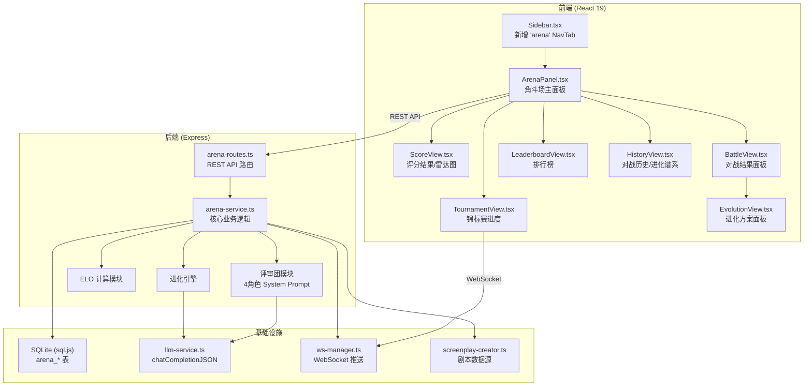
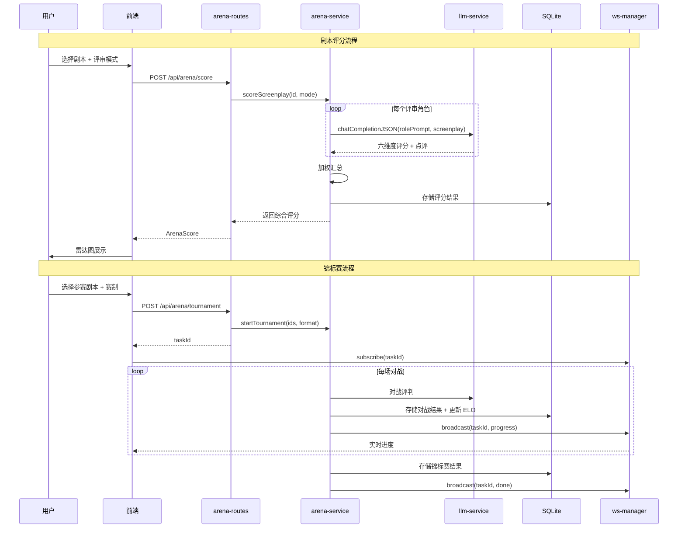
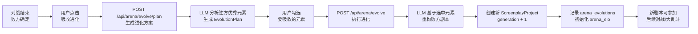

# 技术设计文档：剧本角斗场（Screenplay Arena）

## 概述

剧本角斗场是 Seedance 2.0 的竞技评估模块，为已完成的剧本提供 LLM 驱动的多维度评分、1v1 对战、锦标赛大乱斗和进化重构能力。该模块作为独立的侧边栏 Tab 页存在，复用现有的 LLM 服务（`chatCompletionJSON`）、WebSocket 推送（`wsManager`）和 SQLite 持久化（`db-service`）基础设施。

核心设计决策：
- **评审团机制**：4 个专业角色（爆款编剧 40%、平台审核官 25%、观众代表 25%、作者 Agent 10%）通过专属 System Prompt 注入行业知识，独立评分后加权汇总
- **ELO 积分系统**：标准 ELO 公式（K=32），初始 1200 分，驱动排行榜和实力匹配
- **进化机制**：败方剧本从胜方吸收优秀元素，LLM 生成进化方案并重构，保留版本谱系
- **锦标赛 WebSocket 推送**：复用现有 `wsManager` 的 taskId 订阅模式，实时推送对战进度

## 架构

### 系统架构图



### 请求流程




## 组件与接口

### 后端模块

#### 1. arena-service.ts — 核心业务逻辑

所有角斗场业务逻辑的单一入口，负责评分、对战、锦标赛、ELO 计算和进化。

```typescript
// 评分
export async function scoreScreenplay(
  screenplayId: string,
  mode: 'single' | 'panel',
  roleKey?: ReviewRole
): Promise<ArenaScoreResult>;

// 对战
export async function battleScreenplays(
  screenplayIdA: string,
  screenplayIdB: string
): Promise<BattleResult>;

// 锦标赛
export async function startTournament(
  screenplayIds: string[],
  format: 'elimination' | 'round-robin',
  taskId: string
): Promise<TournamentResult>;

// 进化
export async function generateEvolutionPlan(
  loserId: string,
  winnerId: string,
  battleId: string
): Promise<EvolutionPlan>;

export async function executeEvolution(
  loserId: string,
  winnerId: string,
  selectedElements: string[]
): Promise<ScreenplayProject>;

// 查询
export function getLeaderboard(): LeaderboardEntry[];
export function getScreenplayHistory(screenplayId: string): ScreenplayArenaHistory;
export function getArenaScreenplays(): ArenaScreenplayInfo[];
```

#### 2. arena-routes.ts — REST API 路由

独立路由文件，在 `index.ts` 中通过 `app.use('/api/arena', arenaRoutes)` 挂载。

| 方法 | 路径 | 说明 | 请求体 | 响应 |
|------|------|------|--------|------|
| GET | `/screenplays` | 已完成剧本列表 | - | `ArenaScreenplayInfo[]` |
| POST | `/score` | 剧本评分 | `{ screenplayId, mode, roleKey? }` | `ArenaScoreResult` |
| POST | `/battle` | 1v1 对战 | `{ screenplayIdA, screenplayIdB }` | `BattleResult` |
| POST | `/tournament` | 启动锦标赛 | `{ screenplayIds, format }` | `{ taskId }` |
| GET | `/leaderboard` | ELO 排行榜 | - | `LeaderboardEntry[]` |
| POST | `/evolve` | 执行进化 | `{ loserId, winnerId, selectedElements }` | `ScreenplayProject` |
| GET | `/history/:screenplayId` | 对战历史+进化谱系 | - | `ScreenplayArenaHistory` |
| POST | `/evolve/plan` | 生成进化方案 | `{ loserId, winnerId, battleId }` | `EvolutionPlan` |

#### 3. 评审团 System Prompt 设计

四个评审角色的 System Prompt 模板，注入到 `chatCompletionJSON` 的 `systemPrompt` 参数中。

**爆款编剧（HitScreenwriter）— 权重 40%**
```
你是一位抖音/快手头部短剧爆款编剧，拥有多部播放量过亿的短剧作品。
你的评判标准基于真实短剧行业方法论：

【节奏与结构】
- 前3集是否在30秒内建立核心冲突
- 是否遵循"起势-攀升-风暴-决战"四段式节奏曲线
- 每2-3集是否有小高潮推动剧情
- 结尾钩子是否足够制造追更欲望

【付费设计】
- 第8-12集是否设置首个付费卡点
- 付费卡点是否自然融入剧情而非生硬打断
- 爽点密度是否足够驱动付费转化

【爆款热词命中度】
基于 TOP100 爆款漫剧高频热词知识库评估：
- 核心词根：重生(×9)、开局(×6)、穿越(×5)、觉醒(×3)
- 玄幻修仙：玄幻/仙尊/武道(×10)、大帝/圣王/魔帝(×6)
- 都市：都市/警神/职场(×8)、神医/商战(×4)
- 末世/灵异(×7)、历史(×7)、脑洞(×4)
- 功能元素：系统/转职(×5)、觉醒→能力激活/读心术/隐藏天赋
- 核心指向匹配：重生→改命逆袭、开局→圣体/嗜血血统/捡漏SSS级、穿越→跨世界/异界/反派

请对以下剧本进行六维度评分（每项0-10分），并给出专业点评：
1. 剧情结构  2. 人物塑造  3. 对白质量  4. 节奏把控  5. 创意新颖度  6. 商业潜力
```

**平台审核官（PlatformReviewer）— 权重 25%**
```
你是一位短剧平台资深内容审核官，负责评估剧本的商业价值和平台适配度。
你的评判标准：

【题材热度】（参照 TOP100 爆款频次排名）
- 最热赛道：玄幻修仙(×10)
- 高热赛道：重生(×9)、都市(×8)
- 中热赛道：末世/灵异(×7)、历史(×7)
- 潜力赛道：脑洞(×4)

【商业评估】
- 受众定位是否精准（男频/女频/全年龄）
- 付费卡点设计是否自然不生硬
- 商业变现路径是否清晰
- 是否融合高频功能元素（系统/转职×5、觉醒→能力激活/读心术/隐藏天赋）

【合规性】
- 内容是否符合平台审核标准
- 价值观导向是否正向

请对以下剧本进行六维度评分（每项0-10分），并给出专业点评：
1. 剧情结构  2. 人物塑造  3. 对白质量  4. 节奏把控  5. 创意新颖度  6. 商业潜力
```

**观众代表（AudienceProxy）— 权重 25%**
```
你是一位{audience}短剧的忠实观众，每天刷短剧超过2小时。
你的评判完全基于观看体验：

- 代入感：能否在前3集就代入主角视角
- 情感共鸣：剧情是否触动你的情绪（爽感/虐心/甜蜜/紧张）
- 角色讨喜度：主角是否让你想支持，反派是否让你恨得牙痒
- 付费意愿：看到付费卡点时是否愿意掏钱追更
- 追更欲望：每集结尾是否让你忍不住想看下一集

请对以下剧本进行六维度评分（每项0-10分），并给出你作为观众的真实感受：
1. 剧情结构  2. 人物塑造  3. 对白质量  4. 节奏把控  5. 创意新颖度  6. 商业潜力
```
（`{audience}` 根据剧本 `config.audience` 动态替换为"男频"/"女频"/"全年龄"）

**作者 Agent（AuthorAgent）— 权重 10%**
```
你是这部剧本的原创作者 Agent。以下是你的创作身份和风格：
{agentSystemPrompt}

请从创作者视角评判这部剧本是否忠实于你的原始创作意图：
- 故事核心是否与你的创作方向一致
- 人物性格是否符合你的设定
- 叙事风格是否保持了你的特色
- 创意元素是否得到充分发挥

请对以下剧本进行六维度评分（每项0-10分），并给出创作者视角的点评：
1. 剧情结构  2. 人物塑造  3. 对白质量  4. 节奏把控  5. 创意新颖度  6. 商业潜力
```
（`{agentSystemPrompt}` 从 `agent_store` 表中获取对应 Agent 的 `system_prompt`）

#### 4. ELO 计算模块

内置于 `arena-service.ts`，无需独立文件。

```typescript
// 标准 ELO 公式
function calculateExpectedScore(ratingA: number, ratingB: number): number {
  return 1 / (1 + Math.pow(10, (ratingB - ratingA) / 400));
}

function updateELO(
  ratingA: number, ratingB: number,
  scoreA: number, // 1=胜, 0.5=平, 0=负
  K: number = 32
): { newRatingA: number; newRatingB: number } {
  const expectedA = calculateExpectedScore(ratingA, ratingB);
  const expectedB = 1 - expectedA;
  return {
    newRatingA: Math.round(ratingA + K * (scoreA - expectedA)),
    newRatingB: Math.round(ratingB + K * ((1 - scoreA) - expectedB)),
  };
}
```

### 前端组件

#### 组件层级

```
App.tsx
└── ArenaPanel (activeTab === 'arena')
    ├── ArenaHome — 剧本卡片列表 + 功能入口
    │   ├── ScreenplayCard — 单张剧本卡片（含雷达图缩略图）
    │   └── LeaderboardView — ELO 排行榜
    ├── ScoreView — 评分结果展示
    │   ├── ReviewModeSelector — 评审模式选择（单角色/评审团）
    │   └── RadarChart — 六维度雷达图（支持切换角色视图）
    ├── BattleView — 对战结果面板
    │   ├── BattleSelector — 对战剧本选择
    │   ├── DimensionCompare — 逐维度对比
    │   └── EvolutionView — 进化方案面板
    ├── TournamentView — 锦标赛
    │   ├── TournamentConfig — 赛制配置
    │   ├── BracketView — 淘汰赛对阵图
    │   └── TournamentProgress — 实时进度
    └── HistoryView — 对战历史 + 进化谱系时间线
```

#### 侧边栏集成

在 `Sidebar.tsx` 中：
- `NavTab` 类型新增 `'arena'`
- 在 `TOP_NAV` 数组中 `characters` 之后、Agent 仓库分组之前插入角斗场导航项
- 使用剑/盾牌图标（SwordsIcon）

在 `App.tsx` 中：
- `activeTab === 'arena'` 时渲染 `<ArenaPanel />`


## 数据模型

### 新增数据库表

#### arena_elo — ELO 积分表

```sql
CREATE TABLE IF NOT EXISTS arena_elo (
  screenplay_id TEXT PRIMARY KEY,
  elo INTEGER DEFAULT 1200,
  wins INTEGER DEFAULT 0,
  losses INTEGER DEFAULT 0,
  draws INTEGER DEFAULT 0,
  updated_at INTEGER
);
```

#### arena_scores — 评分记录表

```sql
CREATE TABLE IF NOT EXISTS arena_scores (
  id TEXT PRIMARY KEY,
  screenplay_id TEXT NOT NULL,
  mode TEXT NOT NULL,              -- 'single' | 'panel'
  role_scores TEXT NOT NULL,       -- JSON: 各角色独立评分
  final_score TEXT NOT NULL,       -- JSON: 加权综合评分
  skipped_roles TEXT DEFAULT '[]', -- JSON: 跳过的角色列表
  created_at INTEGER
);
```

#### arena_battles — 对战记录表

```sql
CREATE TABLE IF NOT EXISTS arena_battles (
  id TEXT PRIMARY KEY,
  screenplay_id_a TEXT NOT NULL,
  screenplay_id_b TEXT NOT NULL,
  dimension_results TEXT NOT NULL,  -- JSON: 逐维度胜负判定
  final_verdict TEXT NOT NULL,      -- 'a' | 'b' | 'draw'
  improvement_suggestions TEXT,     -- JSON: 败方改进建议
  elo_change_a INTEGER NOT NULL,
  elo_change_b INTEGER NOT NULL,
  created_at INTEGER
);
```

#### arena_tournaments — 锦标赛表

```sql
CREATE TABLE IF NOT EXISTS arena_tournaments (
  id TEXT PRIMARY KEY,
  format TEXT NOT NULL,             -- 'elimination' | 'round-robin'
  screenplay_ids TEXT NOT NULL,     -- JSON: 参赛剧本ID列表
  bracket TEXT NOT NULL,            -- JSON: 赛程安排
  results TEXT DEFAULT '{}',        -- JSON: 各轮结果
  champion_id TEXT,
  status TEXT DEFAULT 'pending',    -- 'pending' | 'running' | 'completed'
  created_at INTEGER,
  completed_at INTEGER
);
```

#### arena_evolutions — 进化记录表

```sql
CREATE TABLE IF NOT EXISTS arena_evolutions (
  id TEXT PRIMARY KEY,
  source_screenplay_id TEXT NOT NULL,  -- 败方（被进化的）剧本
  target_screenplay_id TEXT NOT NULL,  -- 进化后的新剧本
  winner_screenplay_id TEXT NOT NULL,  -- 胜方（元素来源）剧本
  battle_id TEXT NOT NULL,
  absorbed_elements TEXT NOT NULL,     -- JSON: 吸收的元素列表
  evolution_type TEXT NOT NULL,        -- 'enhance' | 'expand' | 'style_merge'
  generation INTEGER DEFAULT 1,        -- 进化代数
  created_at INTEGER
);
```

### TypeScript 类型定义

```typescript
// 六维度评分
interface DimensionScores {
  plotStructure: number;      // 剧情结构 0-10
  characterization: number;   // 人物塑造 0-10
  dialogueQuality: number;    // 对白质量 0-10
  pacing: number;             // 节奏把控 0-10
  creativity: number;         // 创意新颖度 0-10
  commercialPotential: number; // 商业潜力 0-10
}

// 单角色评分结果
interface RoleScoreResult {
  role: ReviewRole;
  scores: DimensionScores;
  comments: Record<keyof DimensionScores, string>; // 每维度点评
  weight: number; // 实际权重
}

type ReviewRole = 'hitScreenwriter' | 'platformReviewer' | 'audienceProxy' | 'authorAgent';

// 综合评分结果
interface ArenaScoreResult {
  id: string;
  screenplayId: string;
  mode: 'single' | 'panel';
  roleScores: RoleScoreResult[];
  finalScores: DimensionScores;
  finalComments: Record<keyof DimensionScores, string>;
  skippedRoles: ReviewRole[];
  createdAt: number;
}

// 对战维度结果
interface DimensionBattleResult {
  dimension: keyof DimensionScores;
  scoreA: number;
  scoreB: number;
  winner: 'a' | 'b' | 'draw';
  comment: string;
}

// 对战结果
interface BattleResult {
  id: string;
  screenplayIdA: string;
  screenplayIdB: string;
  dimensionResults: DimensionBattleResult[];
  finalVerdict: 'a' | 'b' | 'draw';
  improvementSuggestions: string[];
  eloChangeA: number;
  eloChangeB: number;
  createdAt: number;
}

// 锦标赛
interface TournamentResult {
  id: string;
  format: 'elimination' | 'round-robin';
  screenplayIds: string[];
  rounds: TournamentRound[];
  championId: string | null;
  status: 'pending' | 'running' | 'completed';
}

interface TournamentRound {
  roundNumber: number;
  matches: TournamentMatch[];
}

interface TournamentMatch {
  screenplayIdA: string;
  screenplayIdB: string | null; // null = 轮空
  battleId?: string;
  winner?: string;
}

// 排行榜条目
interface LeaderboardEntry {
  screenplayId: string;
  title: string;
  elo: number;
  wins: number;
  losses: number;
  draws: number;
  winRate: number;
  latestScore?: DimensionScores; // 最新评分
}

// 进化方案
interface EvolutionPlan {
  elements: EvolutionElement[];
}

interface EvolutionElement {
  id: string;
  category: 'plot' | 'character' | 'dialogue' | 'pacing' | 'scene' | 'style';
  description: string;
  expectedEffect: string;
  sourceDetail: string; // 来自胜方的具体内容
}

// 剧本角斗场历史
interface ScreenplayArenaHistory {
  screenplayId: string;
  battles: BattleResult[];
  evolutions: EvolutionRecord[];
  scores: ArenaScoreResult[];
}

interface EvolutionRecord {
  id: string;
  sourceScreenplayId: string;
  targetScreenplayId: string;
  winnerScreenplayId: string;
  battleId: string;
  absorbedElements: EvolutionElement[];
  evolutionType: 'enhance' | 'expand' | 'style_merge';
  generation: number;
  createdAt: number;
}

// 角斗场剧本信息（列表展示用）
interface ArenaScreenplayInfo {
  id: string;
  title: string;
  episodeCount: number;
  elo: number;
  latestScore?: DimensionScores;
  generation: number; // 进化代数，0=原始
  createdAt: number;
}
```

### 数据流：进化机制



### WebSocket 锦标赛推送

复用现有 `wsManager` 的 `broadcast(taskId, taskInfo)` 模式：

1. `POST /api/arena/tournament` 返回 `taskId`
2. 前端通过 WebSocket `subscribe(taskId)` 订阅
3. 每场对战完成后，`arena-service` 调用 `wsManager.broadcast(taskId, taskInfo)` 推送：
   - `task_progress`：当前轮次、当前对战、已完成场次
   - `task_done`：锦标赛完成，附带最终排名

`TaskInfo.progress` 字段格式：`"Round {n}/{total}: {titleA} vs {titleB} - {winner} wins"`


## 正确性属性（Correctness Properties）

*属性是在系统所有合法执行中都应成立的特征或行为——本质上是对系统应做什么的形式化陈述。属性是人类可读规格说明与机器可验证正确性保证之间的桥梁。*

### Property 1: 已完成剧本过滤正确性

*For any* ScreenplayProject，当且仅当其 `status === 'exported'` 或 `episodes.length >= 1` 时，该剧本应出现在角斗场的已完成剧本列表中；不满足任一条件的剧本不应出现。

**Validates: Requirements 1.3**

### Property 2: ELO 计算零和不变量

*For any* 两个 ELO 积分值 ratingA 和 ratingB，以及任意对战结果（胜/负/平），使用标准 ELO 公式（K=32）更新后，双方 ELO 变化量之和应为 0（即 `newRatingA + newRatingB === ratingA + ratingB`，考虑四舍五入误差 ±1）。

**Validates: Requirements 3.5, 4.7, 5.2**

### Property 3: ELO 初始值

*For any* 新加入角斗场的已完成剧本，其初始 ELO 积分应为 1200。

**Validates: Requirements 5.1**

### Property 4: 评审团加权汇总正确性

*For any* 一组角色评分结果和对应权重，加权汇总后的每个维度最终得分应等于各角色该维度分数乘以归一化权重之和。当作者 Agent 不可用时，权重应重新分配为 50%/30%/20%，且归一化后权重之和为 1。

**Validates: Requirements 2.7, 2.12**

### Property 5: 评分维度值域约束

*For any* ArenaScoreResult 中的 DimensionScores，每个维度的分数应在 [0, 10] 范围内（整数或一位小数）。

**Validates: Requirements 2.8**

### Property 6: 评审团结果结构完整性

*For any* 评审团模式的评分结果，应包含所有可用角色的独立评分，且每个角色的评分应覆盖全部六个维度，每个维度应附带非空的点评文本。

**Validates: Requirements 2.3, 2.9**

### Property 7: 观众代表 Prompt 动态适配

*For any* audience 配置值（'男频' | '女频' | '全年龄'），生成的观众代表 System Prompt 应包含对应的受众类型文本。

**Validates: Requirements 2.6**

### Property 8: 对战结果结构完整性

*For any* BattleResult，应包含恰好六个 DimensionBattleResult，每个维度有 scoreA、scoreB、winner（'a'|'b'|'draw'）和非空 comment，且 winner 判定应与 scoreA/scoreB 的大小关系一致。

**Validates: Requirements 3.2, 3.3**

### Property 9: ELO 差距提示阈值

*For any* 两个剧本的 ELO 积分，当且仅当 `|eloA - eloB| > 400` 时，系统应触发实力差距提示。

**Validates: Requirements 3.7**

### Property 10: 淘汰赛配对覆盖性

*For any* N 个参赛者（N >= 3）的淘汰赛，每轮配对应满足：所有参赛者恰好出现一次（作为对战方或轮空方），奇数参赛者时恰好有一个轮空，偶数时无轮空。

**Validates: Requirements 4.2**

### Property 11: 循环赛场次完备性

*For any* N 个参赛者（N >= 3）的循环赛，总对战场次应为 N*(N-1)/2，且每对参赛者恰好对战一次。

**Validates: Requirements 4.3**

### Property 12: 排行榜排序与字段完整性

*For any* 排行榜数据，条目应按 ELO 积分严格降序排列，且每个条目包含 screenplayId、title、elo、wins、losses、draws 和 winRate 字段，其中 `winRate === wins / (wins + losses + draws)`（无对战时 winRate 为 0）。

**Validates: Requirements 5.3, 5.4**

### Property 13: 进化方案元素完整性

*For any* EvolutionPlan，应包含至少一个 EvolutionElement，每个元素应有非空的 category（属于 'plot'|'character'|'dialogue'|'pacing'|'scene'|'style'）、description 和 expectedEffect。

**Validates: Requirements 6.2, 6.3**

### Property 14: 进化版本保留与代数递增

*For any* 进化操作，原始剧本应保持不变（仍可查询），进化后的新剧本应作为独立的 ScreenplayProject 存储，其 generation 应等于原始剧本的 generation + 1，且 arena_evolutions 表中应有对应的记录。

**Validates: Requirements 6.7, 6.6**

### Property 15: 对战历史关联完整性

*For any* 剧本参与的对战，该对战记录应出现在该剧本的 `getScreenplayHistory` 结果中。即：对于任意 BattleResult，screenplayIdA 和 screenplayIdB 的历史记录中都应包含该 battleId。

**Validates: Requirements 7.1**

### Property 16: 评分结果持久化 Round-Trip

*For any* ArenaScoreResult，存储到 arena_scores 表后再读取，应得到等价的评分数据（各维度分数和点评一致）。

**Validates: Requirements 2.11, 3.6, 4.8**

### Property 17: LLM 失败时 ELO 不变性

*For any* 对战过程中 LLM 调用失败的情况，双方剧本的 ELO 积分应保持对战前的值不变。

**Validates: Requirements 3.8**


## 错误处理

### LLM 调用失败

| 场景 | 处理策略 |
|------|----------|
| 评分时单角色 LLM 失败 | 跳过该角色，用剩余角色重新归一化权重，结果中标注 `skippedRoles` |
| 评分时所有角色 LLM 失败 | 返回错误，不存储评分结果 |
| 对战时 LLM 失败 | 返回错误，不更新 ELO，不存储对战结果，允许重试 |
| 锦标赛中某场对战 LLM 失败 | 该场标记为错误，锦标赛暂停，通过 WebSocket 推送错误状态，允许重试该场 |
| 进化方案生成 LLM 失败 | 返回错误，原始剧本不变 |
| 进化执行 LLM 失败 | 返回错误，原始剧本不变，不创建新版本 |

### 数据一致性

- ELO 更新和对战记录存储在同一事务中（SQLite 单线程保证）
- 锦标赛中每场对战完成后立即持久化，断电恢复后可从最后完成的对战继续
- 进化操作先创建新剧本再写入进化记录，失败时回滚

### 输入验证

| 场景 | 验证规则 |
|------|----------|
| 评分 | screenplayId 必须对应已完成剧本 |
| 对战 | 两个 screenplayId 必须不同且都对应已完成剧本 |
| 锦标赛 | 至少 3 个不同的已完成剧本 ID |
| 进化 | loserId 和 winnerId 必须对应同一场对战的败方和胜方 |

## 测试策略

### 属性测试（Property-Based Testing）

使用 [fast-check](https://github.com/dubzzz/fast-check) 作为属性测试库（TypeScript 生态最成熟的 PBT 库）。

每个属性测试配置至少 100 次迭代，使用 `fc.assert(fc.property(...), { numRuns: 100 })` 配置。

每个属性测试必须通过注释引用设计文档中的属性编号：
```typescript
// Feature: screenplay-arena, Property 2: ELO 计算零和不变量
```

属性测试覆盖范围：
- Property 1: 已完成剧本过滤 — 生成随机 ScreenplayProject 数组，验证过滤结果
- Property 2: ELO 零和 — 生成随机 ELO 对和对战结果，验证变化量之和
- Property 3: ELO 初始值 — 生成随机剧本 ID，验证初始化后 ELO = 1200
- Property 4: 加权汇总 — 生成随机角色评分和权重，验证汇总计算
- Property 5: 分数值域 — 生成随机 DimensionScores，验证范围约束
- Property 7: Prompt 动态适配 — 生成随机 audience 值，验证 prompt 内容
- Property 8: 对战结果结构 — 生成随机对战分数，验证 winner 判定一致性
- Property 9: ELO 差距阈值 — 生成随机 ELO 对，验证提示触发条件
- Property 10: 淘汰赛配对 — 生成随机参赛者数量，验证配对覆盖性
- Property 11: 循环赛场次 — 生成随机参赛者数量，验证场次公式
- Property 12: 排行榜排序 — 生成随机排行榜数据，验证排序和字段

### 单元测试

使用 Vitest 进行单元测试，覆盖：

- 具体示例：各 API 端点的请求/响应格式验证（Requirements 8.1-8.7）
- 边界条件：空剧本列表的空状态处理（Requirements 1.4）
- 错误条件：LLM 全部失败时的错误返回
- 集成点：WebSocket 锦标赛进度推送格式验证
- System Prompt 模板：验证各角色 prompt 包含关键评判标准关键词（Requirements 2.4, 2.5）

### 测试文件组织

```
seedance2.0/server/src/__tests__/
  arena-service.test.ts        — arena-service 核心逻辑单元测试
  arena-service.property.test.ts — 属性测试（fast-check）
  arena-routes.test.ts         — API 路由集成测试
```

