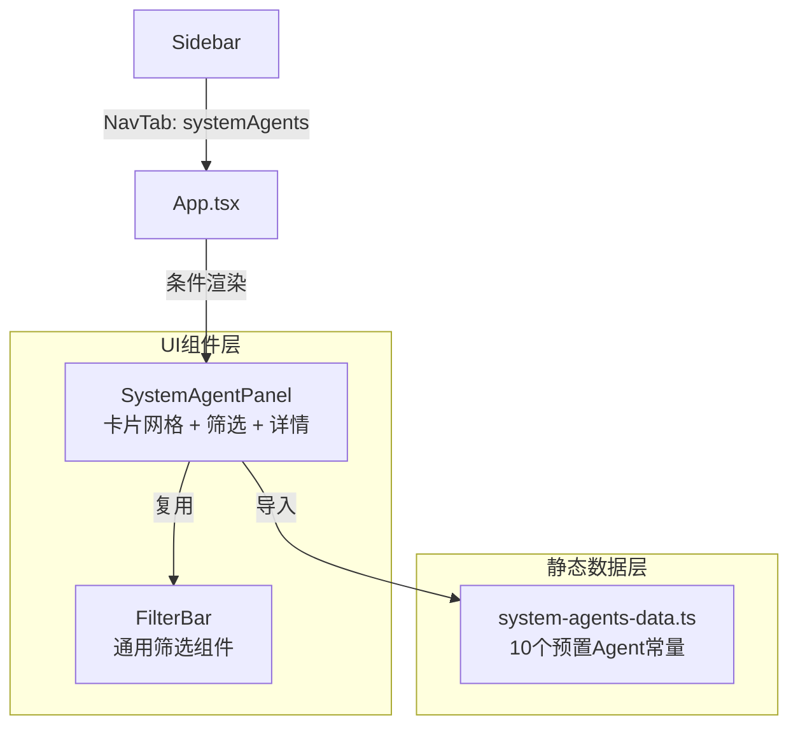

# 设计文档：系统Agent

## 概述

本功能在现有Agent仓库中新增"系统Agent"子菜单，预置10个编剧风格提示词作为系统Agent。系统Agent采用纯前端静态数据方案，无需后端API或数据库存储。面板UI复用现有AgentStorePanel的视觉风格和交互模式，但移除删除/编辑功能，保持只读特性。

### 关键设计决策

1. **纯前端静态数据**：系统Agent数据以TypeScript常量数组定义在独立文件中，无需后端API。理由：预置数据固定不变，无需持久化或动态管理。
2. **复用现有UI模式**：面板布局、卡片样式、筛选栏、详情侧滑面板均复用AgentStorePanel的设计模式。理由：保持UI一致性，减少开发量。
3. **NavTab扩展**：新增`systemAgents`导航标签类型。理由：与现有`authorAgents`和`characterAgents`保持一致的路由模式。

## 架构



### 数据流

1. `SystemAgentPanel`组件挂载时，直接从`system-agents-data.ts`导入静态常量数组
2. 筛选操作在前端内存中完成（`useMemo`过滤）
3. 点击卡片直接从常量数组中查找详情，无需异步请求

## 组件与接口

### 1. 导航扩展

**文件：`src/components/Sidebar.tsx`**

- 扩展`NavTab`类型，新增`'systemAgents'`
- 在`AGENT_SUB_NAV`数组中添加系统Agent菜单项
- 新增`ShieldIcon`图标组件（区别于作者仓库的PenIcon和群演仓库的TheaterIcon）

**文件：`src/App.tsx`**

- 在面板条件渲染中添加`systemAgents`分支，渲染`SystemAgentPanel`
- 更新`isAgentTab`判断逻辑，包含`systemAgents`

### 2. 系统Agent面板

**文件：`src/components/SystemAgentPanel.tsx`**（新建）

```typescript
interface SystemAgentItem {
  id: string;
  name: string;
  genre: string;
  tone: string;
  description: string;
}

interface SystemAgentDetail extends SystemAgentItem {
  systemPrompt: string;
}
```

**组件职责**：
- 从静态数据导入Agent列表
- 提供风格/语调筛选（复用FilterBar）
- 卡片网格展示（复用AgentStorePanel的卡片样式）
- 侧滑详情面板（无删除按钮，仅有"复制Prompt"）
- 支持i18n中英文切换

### 3. 静态数据模块

**文件：`src/constants/system-agents-data.ts`**（新建）

```typescript
export interface SystemAgent {
  id: string;
  name: string;
  genre: string;
  tone: string;
  description: string;
  systemPrompt: string;
}

export const SYSTEM_AGENTS: SystemAgent[] = [
  // 10个预置编剧风格Agent
];
```

## 数据模型

### SystemAgent 接口

| 字段 | 类型 | 说明 |
|------|------|------|
| id | string | 唯一标识，格式`sys-{序号}`，如`sys-01` |
| name | string | Agent名称，如"听花岛风格" |
| genre | string | 风格分类，如"女频复仇"、"男频战神" |
| tone | string | 语调标签，如"极致情绪"、"电影感" |
| description | string | 简要描述（1-2句话） |
| systemPrompt | string | 完整的编剧风格提示词 |

### 10个预置Agent数据概要

| ID | 名称 | 风格 | 语调 |
|----|------|------|------|
| sys-01 | 听花岛风格 | 女频复仇 | 极致情绪 |
| sys-02 | 编剧"倾故"风格 | 现实主义 | 电影感 |
| sys-03 | 麦芽传媒风格 | 全题材爆款 | 标准化 |
| sys-04 | 编剧"九九"风格 | 流量算法 | 钩子矩阵 |
| sys-05 | 严沛梁风格 | 马甲流 | 阶级反差 |
| sys-06 | 格物千帆风格 | 男频战神 | 热血中二 |
| sys-07 | 余茵风格 | 破碎美学 | 虐恋情深 |
| sys-08 | 卓渊影视风格 | 高概念奇幻 | 视觉奇观 |
| sys-09 | 西安匣子风格 | 甜宠 | 工业糖精 |
| sys-10 | 三笙万物风格 | 潮流解构 | 毒舌讽刺 |


## 正确性属性

*正确性属性是一种在系统所有有效执行中都应成立的特征或行为——本质上是关于系统应该做什么的形式化陈述。属性作为人类可读规格与机器可验证正确性保证之间的桥梁。*

### Property 1: 系统Agent数据完整性

*For any* 系统Agent，其数据对象应包含所有必需字段（id、name、genre、tone、description、systemPrompt），且每个字段均为非空字符串。

**Validates: Requirements 2.1, 3.2, 5.2**

### Property 2: 筛选正确性

*For any* 筛选条件（风格或语调），筛选后的结果列表中所有Agent的对应字段值都应等于该筛选条件值，且结果数量应小于等于总Agent数量。

**Validates: Requirements 4.2, 4.3**

### Property 3: Prompt复制正确性

*For any* 系统Agent，执行复制操作后，剪贴板中的内容应与该Agent的systemPrompt字段完全一致。

**Validates: Requirements 6.2**

## 错误处理

由于系统Agent采用纯前端静态数据方案，错误场景较少：

1. **筛选无结果**：当筛选条件导致无匹配Agent时，显示"没有匹配的Agent"提示和"清除筛选"按钮
2. **剪贴板API不可用**：当`navigator.clipboard`不可用时（如非HTTPS环境），使用`document.execCommand('copy')`作为降级方案
3. **详情面板状态**：当选中的Agent ID无法在数据中找到时，不打开详情面板

## 测试策略

### 属性测试

使用 `vitest` + `fast-check` 进行属性测试：

- **Property 1**：生成随机索引，验证对应Agent的所有字段非空
- **Property 2**：从Agent数据中随机选取genre/tone值作为筛选条件，验证筛选结果的正确性
- **Property 3**：随机选取Agent，模拟复制操作，验证剪贴板内容

每个属性测试至少运行100次迭代。每个测试需标注对应的设计属性：
- 标签格式：**Feature: system-agents, Property {number}: {property_text}**

### 单元测试

使用 `vitest` + `@testing-library/react` 进行单元测试：

- 验证SystemAgentPanel渲染正确数量的卡片
- 验证点击卡片打开详情面板
- 验证详情面板关闭行为
- 验证不存在删除按钮
- 验证i18n文本切换
- 验证筛选栏的清除功能

### 测试配置

- 属性测试库：`fast-check`
- 测试框架：`vitest`
- React测试：`@testing-library/react`
- 每个属性测试配置最少100次迭代
- 每个正确性属性由单独的属性测试实现
